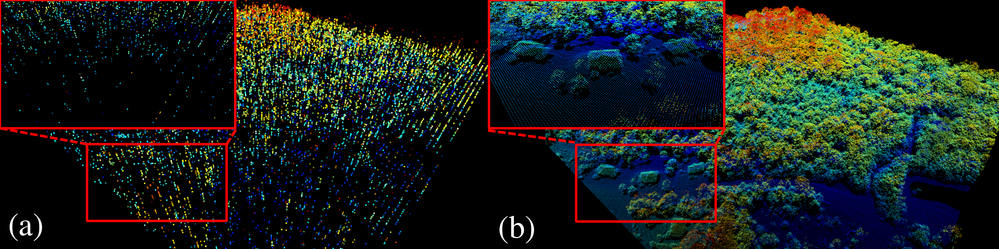

## Diffusion-Based Joint Recovery, Denoising, and Super-Resolution of Compressed-Sensing Satellite LiDAR Data

Final code for the paper pipeline that reconstructs canopy volumes using a diffusion model with a Poisson forward imaging model. The entrypoint is `SingleLikelihood.py`.

### Paper details

- Title: "Diffusion-Based Joint Recovery, Denoising, and Super-Resolution of Compressed-Sensing Satellite LiDAR Data"
- Authors: Andres Ramirez-Jaime (Graduate Student Member, IEEE), Nestor Porras-Diaz (Graduate Student Member, IEEE), Mark Stephen, Guangning Yang, and Gonzalo R. Arce (Life Fellow, IEEE)
- Affiliations: University of Delaware, Dept. of Electrical and Computer Engineering (aramjai@udel.edu; nestorfe@udel.edu; arce@udel.edu) and NASA Goddard Space Flight Center (mark.a.stephen@nasa.gov; guangning.yang-1@nasa.gov)
- Funding: U.S. National Science Foundation Grant No. 2404740 and NASA Grant No. 80NSSC25K7395
- Links: dataset https://huggingface.co/datasets/anfera236/HHDC

### Quickstart

1. Python 3.10+ recommended. Install deps: `pip install -r requirements.txt`.
2. Place inputs in `data/TestCube/` (`input{RESOLUTION}.npy` and `gt{RESOLUTION}.npy` or the provided `gt2.npy`). The default blue-noise mask now lives at `assets/Mblue.tiff`.
3. Add the pretrained checkpoint at `results/model{RESOLUTION}.pt` (resolution defaults to 2; adjust in `src/config.py`).
4. Run inference: `python SingleLikelihood.py`. Outputs land in `resultCubes/` (final artifacts) and `intermediateCubesTest/` (DDIM snapshots).

### Configuration

All tunable knobs live in `src/config.py` (resolution, sampling steps, mask type and ratio, physics model parameters, thresholds, and output locations). Update `CHECKPOINT_TEMPLATE`/`CHECKPOINT_DIR` if your weights live elsewhere.

### Repository Layout

- `SingleLikelihood.py` — main inference script wired to the diffusion model and Poisson forward operator.
- `src/` — supporting modules (`config.py`, `data_utils.py`, `forward_model.py`, `mask_utils.py`, `visualization.py`, `canopyPlots.py`) plus the trimmed `denoising_diffusion_pytorch/` package.
- `data/TestCube/` — expected location for the provided input/ground-truth `.npy` cubes.
- `assets/Mblue.tiff` — default blue-noise sampling mask used for inference.
- `assets/images/` — figures referenced by the README.

### Notes

- `Trainer` now supports `inference_only=True`, so inference does not require the training dataset.
- Generated artifacts (`resultCubes/`, `intermediateCubesTest/`, `results/`) are git-ignored by default.
